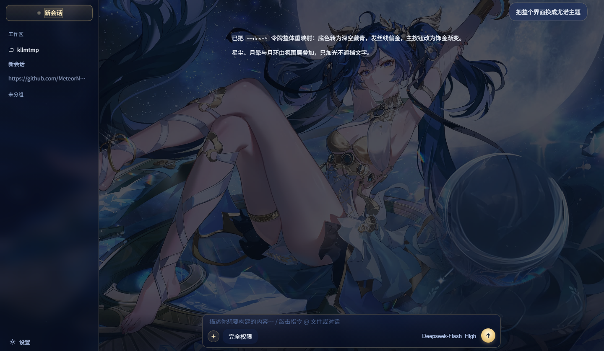

# DSH 尤诺主题（DeepSeek Iuno Skin）



把 DeepSeek Harness（DSH）Web 界面铺上你指定的尤诺立绘作背景，UI 保持纤细极简——
侧栏一缕玻璃、按钮一格金边、发送一弯月。不加挂件、不堆装饰。

标准 DSH bundle 插件，`dsh plugin` 安装/卸载。

## 这次的设计取向

**壁纸做主角，UI 做配角。** 上一版我把界面装饰得"满城黄金"——月环框标题、水晶棱按钮、点击涟漪、光标月华——太重了，用户根本看不清立绘。这版只留下：

- **壁纸**：整张立绘铺满，只 `brightness(.86)` 极轻微压暗保证可读
- **侧栏**：半透明玻璃 + 1 像素金色右缘发丝线；新会话是圆角金边按钮
- **输入卡**：1 像素金色边框 + 轻玻璃 + 适度留白（去掉四角支架、内环、水印）
- **发送按钮**：一弯尤诺蓝下弦月（见下「月牙按钮」）
- **「+」按钮**：圆形细金边（去掉水晶六边形）
- **氛围**：仅一层极轻星尘 + 几颗会眨眼的星（去掉极光、水晶、涟漪、光标月华、四角金细工）
- **交互**：按钮 hover 浮起 + 月光拂过、按下回弹、气泡入场浮现、侧栏收放平滑过渡——全部纯 CSS，不往 React DOM 里插任何节点
- **月牙按钮**：发送键与「新会话」共用同一枚尤诺蓝下弦月（共享 `--yn-moon-svg`，内联 SVG evenodd 镂空，内圆与外圆内切、首尾相接成一整瓣）；发送键就绪时蓝光呼吸、按下绽开月环
- **鼠标流光**：一颗月光彗头拖着带惯性的蓝色丝带（虚拟光标逐帧缓动，轨迹像绸缎），偶尔溅出星屑；canvas 只发光不挡点击，跟随氛围浓度开关
- **桌宠**：右下角一只 Q 版尤诺（整张贴纸，不切割），轻轻漂浮、朝鼠标歪头、点击蹦跳说话、可拖动记住位置；**鼠标悬停**时脚下浮出余额小签（`/user/balance` 服务端 60s 缓存；贴屏幕底缘时自动翻到左上角，台词气泡层级更高绝不被挡）；**右键打开小面板**：音效开关、音色（风铃/月琴/水滴，WebAudio 现场合成无素材）、待机碎碎念节奏（固定 = 无互动满 2 分钟轻声一句；随机 = 1~4 分钟不定时）；台词覆盖任务**开始/进行中/完成/中断**与待机关怀，人设傲娇但句句像恋人；进行中每 20~45s 随机陪一句，鼠标键盘任何互动都会重置待机计时

## 调壁纸清晰度

`lib/theme.css` 里 `.yn-skin-wall` 的 `filter: brightness(.86)` 那一行就是壁纸浓度。
想要更亮就调到 0.92；想要更暗就 0.78。

## 目录结构

```text
DeepSeek-Iuno-Widget/
├── package.json
├── cordis.patch.yml
├── README.md
├── skin-preview.html         # 免安装复刻预览（自包含，壁纸 data URI 内联）
├── lib/
│   ├── index.js              # 宿主插件：静态资源路由 + size.json
│   ├── theme.css             # 整站皮肤（令牌 + 组件 + 氛围）
│   ├── theme.js              # 注入壁纸 + 氛围层（纯挂 body，不碰 React 子树）
│   ├── pet.css               # 右下角桌宠样式
│   ├── pet.js                # 桌宠行为（漂浮 / 歪头 / 台词 / 右键面板）
│   └── trail.js              # 鼠标流光（canvas 月光丝带）
├── assets/
│   ├── iuno-wall.jpg         # 界面壁纸（2560×1440）
│   ├── iuno-pet.png          # 桌宠贴纸（透明底）
│   ├── Iuno-Q.png            # Q 版素材源图
│   └── preview.png           # README 预览图
└── tools/
    ├── extract_dsh_css.py    # 从本机 DSH 包中抽取真实组件样式
    ├── build_skin_preview.py # 生成复刻预览（类名实际存在性校验）
    └── make_pet_sprite.py    # 由源图生成桌宠贴纸
```

## 安装

在仓库根目录（`package.json` 所在目录）执行：

```powershell
dsh plugin --profile web add link:.
```

安装后**重启 `dsh web`** 再 F5 刷新（皮肤走 index.html 注入，只在启动时生效）。

### 给 AI 的安装说明

```
请帮我安装插件 dsh-iuno-widget（DSH 尤诺主题皮肤）。

1. pnpm 可用即可：npm i -g pnpm
2. dsh plugin --profile web add link:<仓库绝对路径>
   （仓库根目录就是插件包，不要写成 link:.\<name> 这种带子目录的）
3. 如报 allowBuilds，在 C:\Users\<u>\.dsh\profiles\web\pnpm-workspace.yaml 加对应包 key 后重跑
4. 重启 dsh web，F5

验证：
- curl http://127.0.0.1:3080/dsh-iuno/theme.css → 200 CSS
- curl http://127.0.0.1:3080/dsh-iuno/theme.js  → 200 JS
- curl http://127.0.0.1:3080/dsh-iuno/wall.jpg  → 200 JPEG
- 页面 <head> 含 /dsh-iuno/theme.css
```

## 验证

```powershell
curl http://127.0.0.1:3080/dsh-iuno/theme.css
curl http://127.0.0.1:3080/dsh-iuno/theme.js
curl http://127.0.0.1:3080/dsh-iuno/wall.jpg
curl http://127.0.0.1:3080/dsh-iuno/size.json
```

## 卸载

```powershell
dsh plugin --profile web remove dsh-iuno-widget
```

## 离线复刻预览

`skin-preview.html` 是一份自包含的预览——它从本机已安装的 `@deepseek-ai/dsh-client-ui-*` 包
中按字符串字面量抽出**真实组件 CSS**，用**真实 CSS Modules 类名**（构建时逐个校验存在）重建 DSH 外壳，
再叠加本仓库皮肤。顶部演示条可切换 `起始页 / 对话页 / 亮色 / 氛围浓度`，URL 参数：

| 参数 | 作用 |
|---|---|
| `?view=chat` | 对话页 |
| `?light=1` | 亮色 |
| `?wall=58,26&zoom=110&blur=3` | 壁纸构图调试 |

重新生成：`python tools/build_skin_preview.py`
（首次需 `python tools/extract_dsh_css.py --dump-dir tools/_dshcss`）

## 常见问题

- **界面没换肤**：确认 `dsh web` 已**重启**（皮肤在启动时注入），F5 后再看；浏览器里检查 `<head>` 是否有 `/dsh-iuno/theme.css`。
- **壁纸太亮 / 太暗**：改 `lib/theme.css` 里 `.yn-skin-wall` 的 `filter: brightness(.86)`。
- **想微调金色**：`--yn-gold`、`--yn-hair` 在 `lib/theme.css` 顶部，改一个值整站跟着变。

## 许可证

MIT License，详见 [LICENSE](LICENSE)。

`assets/iuno-wall.jpg` 为角色素材，版权归原作者及游戏发行方所有，仅供个人学习与本地使用，请勿商用。
