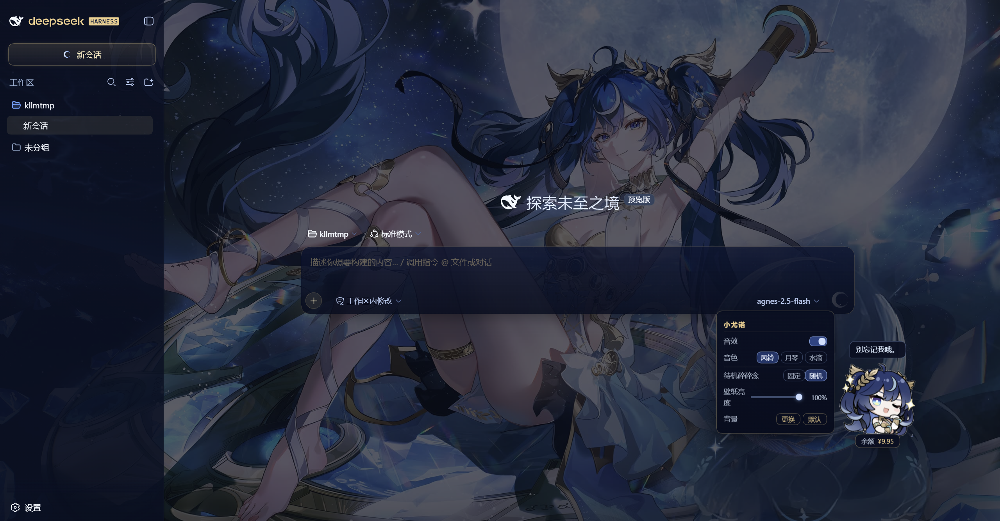
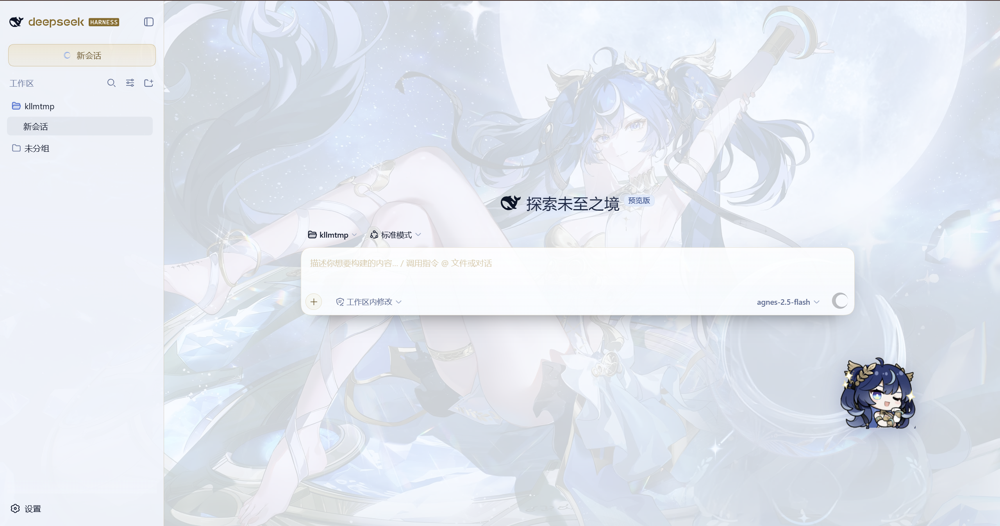
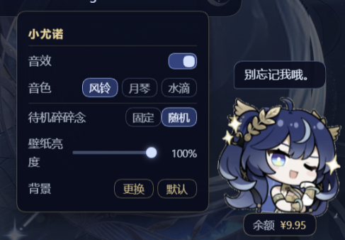
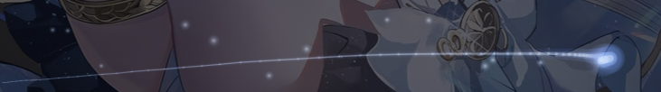

# DSH 尤诺主题（DeepSeek Iuno Skin）




把 DeepSeek Harness（DSH）Web 界面铺上指定的尤诺立绘作背景，UI 保持纤细极简——
侧栏一缕玻璃、按钮一格金边、发送一弯月。标准 DSH bundle 插件，`dsh plugin` 安装/卸载。

## 功能



- **壁纸**：整张立绘铺满，`brightness` 轻微压暗保证文字可读
- **侧栏**：半透明玻璃 + 1 像素金色右缘发丝线；新会话为圆角金边按钮
- **输入卡**：1 像素金色边框 + 轻玻璃 + 适度留白
- **发送按钮**：一弯尤诺蓝下弦月，就绪时蓝光呼吸，按下绽开月环
- **氛围**：一层极轻星尘 + 几颗会眨眼的星，浓度可关
- **鼠标流光**：一颗月光彗头拖着带惯性的蓝色丝带，跟随氛围浓度开关

- **桌宠**：右下角一只 Q 版尤诺贴纸，轻轻漂浮、朝鼠标歪头、点击蹦跳说话、可拖动并记住位置；
  鼠标悬停时脚下浮出余额小签（`/user/balance` 服务端 60s 缓存）
- **右键小面板**（右键桌宠打开）：
  - 音效开关、音色（风铃 / 月琴 / 水滴，WebAudio 现场合成无素材）
  - 待机碎碎念节奏（固定 = 无互动满 2 分钟轻声一句；随机 = 1~4 分钟不定时）
  - **壁纸亮度**滑杆（0.40–1.00，实时生效，持久化到服务端）
  - **更换背景**：从本地选一张图片上传替换壁纸；点「默认」恢复内置立绘

## 使用

- 右键桌宠打开小面板调整；设置持久化在 `~/.dsh/.dshy-size.json`（氛围、壁纸亮度）
  和 `~/.dsh/.dshy-wall-custom.bin`（自定义壁纸）。
- 壁纸太亮 / 太暗：直接拖面板里的「壁纸亮度」滑杆，不用改 CSS。
- 想微调金色：`--yn-gold`、`--yn-hair` 在 `lib/theme.css` 顶部，改一个值整站跟着变。

## 目录结构

```text
DeepSeek-Iuno-Widget/
├── package.json
├── cordis.patch.yml
├── README.md
├── lib/
│   ├── index.js              # 宿主插件：静态资源路由 + 壁纸/配置读写
│   ├── theme.css             # 整站皮肤（令牌 + 组件 + 氛围）
│   ├── theme.js              # 注入壁纸 + 氛围层（纯挂 body，不碰 React 子树）
│   ├── pet.css               # 右下角桌宠与右键面板样式
│   ├── pet.js                # 桌宠行为（漂浮 / 歪头 / 台词 / 右键面板）
│   └── trail.js              # 鼠标流光（canvas 月光丝带）
├── assets/
│   ├── iuno-wall.jpg         # 界面壁纸（2560×1440）
│   ├── iuno-pet.png          # 桌宠贴纸（透明底）
│   ├── Iuno-Q.png            # Q 版素材源图
│   ├── preview0.png          # README 预览图（深色）
│   └── preview1.png          # README 预览图（对话页）
└── tools/
    └── make_pet_sprite.py    # 由源图生成桌宠贴纸
```

## 安装

1. 先拿到插件源码：从 [Releases](https://github.com/MrKLLM/DeepSeek-Iuno-Widget/releases) 下载最新压缩包并解压，或 `git clone` 本仓库到本地任意位置。记下你放源码的目录，下文记作 `<插件路径>`（即 `package.json` 所在目录）。

2. 执行安装（任选一种）：

```powershell
# 写法一：cd 进插件目录，再用相对路径
cd <插件路径>
dsh plugin --profile web add link:.

# 写法二：不 cd，直接写绝对路径（link: 后紧跟路径，中间不要空格）
dsh plugin --profile web add link:<插件路径>
```

不要写成 `link:.\<子目录>` 这种带子目录的形式。安装后**重启 `dsh web`** 再 F5 刷新。

### 给 AI 的安装说明（如果用agent安装）

```
请帮我安装插件 dsh-iuno-widget（DSH 尤诺主题皮肤）。

1. pnpm 可用即可：npm i -g pnpm
2. dsh plugin --profile web add link:<仓库绝对路径>
   （仓库根目录就是插件包，不要写成 link:.\<name> 这种带子目录的）
3. 如报 allowBuilds，在 C:\Users\<u>\.dsh\profiles\web\pnpm-workspace.yaml 加对应包 key 后重跑
4. 重启 dsh web，F5

```

## 验证（可跳过）

```powershell
curl http://127.0.0.1:3080/dsh-iuno/theme.css
curl http://127.0.0.1:3080/dsh-iuno/theme.js
curl http://127.0.0.1:3080/dsh-iuno/wall.jpg
curl http://127.0.0.1:3080/dsh-iuno/size.json
```

## 卸载

```powershell
dsh plugin --profile web remove dsh-iuno-widget
```


## 常见问题

- **界面没换肤**：首次安装后需要**重启 `dsh web`**（注入脚本走启动时的 index.html 改写）；之后改 CSS / JS 直接 F5 即可，`Cache-Control: no-store` 不会吃旧缓存。仍不生效再硬刷一次（Ctrl+F5）或重启 dsh。
- **壁纸亮度 / 更换背景没反应**：右键桌宠打开面板，拖滑杆实时生效、选图即换；面板是静态 JS，F5 就能拿到新版。
- **壁纸太亮 / 太暗**：右键桌宠，拖「壁纸亮度」滑杆即可，无需改代码。
- **换了背景想还原**：右键桌宠 → 背景 → 「默认」。
- **想微调金色**：`--yn-gold`、`--yn-hair` 在 `lib/theme.css` 顶部，改一个值整站跟着变。

## 许可证

MIT License，详见 [LICENSE](LICENSE)。

`assets/iuno-wall.jpg` 为角色素材，版权归原作者及游戏发行方所有，仅供个人学习与本地使用，请勿商用。
