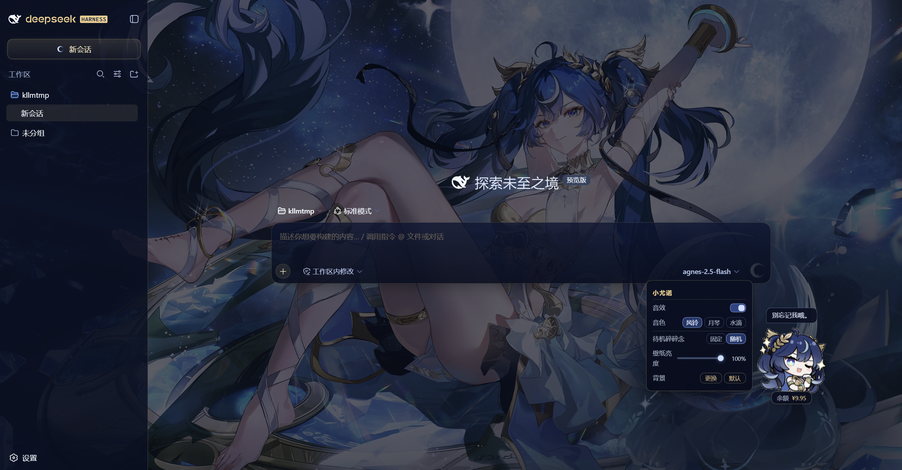
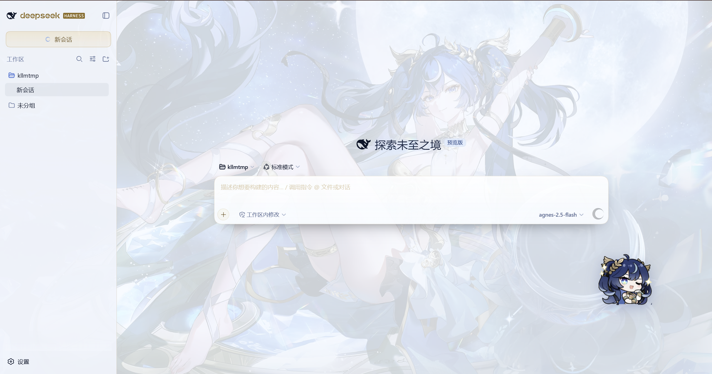
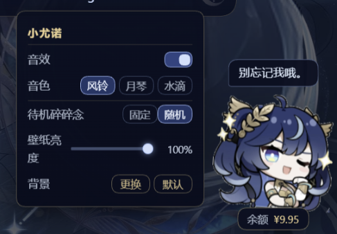
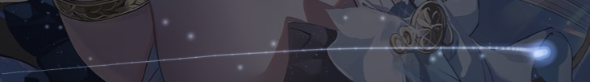

# DSH 尤诺主题（DeepSeek Iuno Skin）




把 DeepSeek Harness（DSH）Web 界面铺上指定的尤诺立绘作背景，UI 保持纤细极简——
侧栏一缕玻璃、按钮一格金边、发送一弯月。标准 DSH bundle 插件，`dsh plugin` 安装/卸载。

## 功能



- **壁纸**：整张立绘铺满，`brightness` 轻微压暗保证文字可读
- **侧栏**：半透明玻璃 + 1 像素金色右缘发丝线；新会话为圆角金边按钮
- **输入卡**：1 像素金色边框 + 轻玻璃 + 适度留白
- **发送按钮**：一弯尤诺蓝下弦月，就绪时蓝光呼吸，按下绽开月环
- **氛围**：一层极轻星尘 + 几颗会眨眼的星，浓度可关
- **鼠标流光**：一颗月光彗头拖着带惯性的蓝色丝带，跟随氛围浓度开关

- **桌宠**：右下角一只 Q 版尤诺贴纸，轻轻漂浮、朝鼠标歪头、点击蹦跳说话、可拖动并记住位置；
  鼠标悬停时脚下浮出余额小签（登录了账号就读账号钱包，否则用 `DEEPSEEK_API_KEY` 查官方
  `/user/balance`；服务端 60s 缓存，金额按分显示，有赠送余额时缀上「赠送 ¥x.xx」）
- **右键小面板**（右键桌宠打开）：
  - 音效开关、音色（风铃 / 月琴 / 水滴，WebAudio 现场合成无素材）
  - 待机碎碎念节奏（固定 = 无互动满 2 分钟轻声一句；随机 = 1~4 分钟不定时）
  - **壁纸亮度**滑杆（0.40–1.00，实时生效，持久化到服务端）
  - **更换背景**：从本地选一张图片上传替换壁纸；点「默认」恢复内置立绘

## 使用

- 右键桌宠打开小面板调整；设置持久化在 `~/.dsh/.dshy-size.json`（氛围、壁纸亮度）
  和 `~/.dsh/.dshy-wall-custom.bin`（自定义壁纸）。
- 壁纸太亮 / 太暗：直接拖面板里的「壁纸亮度」滑杆，不用改 CSS。
- 想微调金色：`--yn-gold`、`--yn-hair` 在 `lib/theme.css` 顶部，改一个值整站跟着变。

## 修订记录

- **v0.9.2**
  - 修「余额小签不更新」：旧代码取到一次就把 `balanceLoaded` 置真、之后再也不请求，
    于是页面加载后余额就**定格**在第一次读到的数字上。现在悬停小签、打开右键面板都会
    重新读（客户端 20s 节流），并带 `?force=1` 让宿主跳过 60s 缓存；
    失败时不再把状态锁死，下次悬停自动重试。
- **v0.9.1**
  - 台词库按游戏内语音表重写（39 条，`lib/pet.js`）：从游戏语音表截图 OCR 出她的原话后
    重新定调——她的「傲娇」是**命令式的偏爱**（勉为其难 / 不准 / 没我不行吧 / 取悦我吧），
    不是通用撒娇腔；保留了 6 条游戏原句或节选，称呼沿用生日语音原句里的 `Darling`。
    各场景（待机 / 任务开始 / 进行中 / 完成 / 中断 / 久无互动）分别重写，长短句搭配。
- **v0.9.0**
  - 修「新会话」按钮被套两层：`[class*="_newSession"]` 会连带命中按钮内部的
    `newSessionContent` / `newSessionShortcut`，于是按钮里出现两个半月牙 + 一层内边框；
    外层规则现在用 `:not()` 排掉内部变体。
  - 余额小签按分显示并标注赠送：接口返回的是 `9.957584100000000` 这种长尾数字符串，
    宿主按分归一并把「充值 / 赠送」两组钱包合成可用余额，显示形如 `¥15.31 赠送 ¥5.35`；
    登录账号时优先读账号钱包，未登录才回退 API key。
  - 起始页标题的月光扫字重新生效：原 `[class*="_headlineText"]` 在当前构建已不存在
    （那个 `<span>` 没有类名），改为按结构取 `[class*="titleGroup"] > span:first-child`。
  - 危险态图标按钮不再被金色 hover 覆盖；模型药丸里的推理档位 `triggerEffort`
    不再跟着药丸一起被高亮。
  - `lib/theme.css` 顶部新增第 0 节「选择器约定」，把易踩的坑写进文件本身。
  - 新增两个自检脚本（见 `tools/`）：`smoke-host.mjs` 宿主冒烟测试、
    `audit-selectors.mjs` 选择器体检（拿真实构建类名撞规则，报 DEAD / 套两层）。

## 选择器约定（改 CSS 前必读）

DSH 前端不给组件稳定类名，只有「哈希 + 可读名」，而且当前构建里两种写法并存：

```css
._2H3hWW_newSession        /* 旧命名：前导下划线 */
.Dc7zOa_composerStack      /* 新命名：无前导下划线 */
```

哈希与可读名之间总有一个下划线，所以皮肤统一用 `[class*="_可读名"]`（两种命名都命中）。
坑在于**前缀相同的内部变体会被一起命中**，外层规则必须用 `:not()` 排掉，例如：

| 目标 | 规则写法 |
| --- | --- |
| 新会话按钮 | `[class*="_newSession"]:not([class*="Label"]):not([class*="Content"]):not([class*="Shortcut"])` |
| 发送按钮 | `[class*="_primary"]:not([class*="Button"]):not([class*="Option"]):not([class*="Item"])` |
| 输入卡 | `[class*="_card"]:not([class*="Workspace"]):not([class*="Icon"]):not([class*="Content"])` |
| 图标按钮 | `[class*="_iconButton"]:not([class*="Danger"])` |
| 药丸触发器 | `[class*="_trigger"]:not([class*="Label"]):not([class*="Icon"]):not([class*="Effort"])` |
| 起始页标题文字 | `<span>` 自己没有类名：`[class*="titleGroup"] > span:first-child` |

改完用 `node tools/audit-selectors.mjs` 体检一遍：它会报出「一个类都命中不到（DEAD）」和
「同模块内部变体被一起命中（RISK）」两类问题。

## 目录结构

```text
DeepSeek-Iuno-Widget/
├── package.json
├── cordis.patch.yml
├── README.md
├── lib/
│   ├── index.js              # 宿主插件：静态资源路由 + 壁纸/配置读写 + 余额
│   ├── theme.css             # 整站皮肤（顶部第 0 节：选择器约定）
│   ├── theme.js              # 注入壁纸 + 氛围层（纯挂 body，不碰 React 子树）
│   ├── pet.css               # 右下角桌宠与右键面板样式
│   ├── pet.js                # 桌宠行为（漂浮 / 歪头 / 台词 / 右键面板 / 余额小签）
│   └── trail.js              # 鼠标流光（canvas 月光丝带）
├── assets/
│   ├── iuno-wall.jpg         # 界面壁纸（2560×1440）
│   ├── iuno-pet.png          # 桌宠贴纸（透明底）
│   ├── Iuno-Q.png            # Q 版素材源图
│   ├── preview0.png          # README 预览图（深色）
│   └── preview1.png          # README 预览图（对话页）
└── tools/
    ├── make_pet_sprite.py    # 由源图生成桌宠贴纸
    ├── smoke-host.mjs        # 宿主冒烟测试（假 ctx，不动真实 profile）
    └── audit-selectors.mjs   # 选择器体检（读 app.asar 真实类名撞规则）
```

## 安装

1. 先拿到插件源码：从 [Releases](https://github.com/MrKLLM/DeepSeek-Iuno-Widget/releases) 下载最新压缩包并解压，或 `git clone` 本仓库到本地任意位置。记下你放源码的目录，下文记作 `<插件路径>`（即 `package.json` 所在目录）。

2. 执行安装（任选一种）：

```powershell
# 写法一：cd 进插件目录，再用相对路径
cd <插件路径>
dsh plugin --profile web add link:.

# 写法二：不 cd，直接写绝对路径（link: 后紧跟路径，中间不要空格）
dsh plugin --profile web add link:<插件路径>
```

不要写成 `link:.\<子目录>` 这种带子目录的形式。安装后**重启 `dsh web`** 再 F5 刷新。

### 给 AI 的安装说明（如果用agent安装）

```
请帮我安装插件 dsh-iuno-widget（DSH 尤诺主题皮肤）。

1. pnpm 可用即可：npm i -g pnpm
2. dsh plugin --profile web add link:<仓库绝对路径>
   （仓库根目录就是插件包，不要写成 link:.\<name> 这种带子目录的）
3. 如报 allowBuilds，在 C:\Users\<u>\.dsh\profiles\web\pnpm-workspace.yaml 加对应包 key 后重跑
4. 重启 dsh web，F5

```

## 验证（可跳过）

```powershell
curl http://127.0.0.1:3080/dsh-iuno/theme.css
curl http://127.0.0.1:3080/dsh-iuno/theme.js
curl http://127.0.0.1:3080/dsh-iuno/wall.jpg
curl http://127.0.0.1:3080/dsh-iuno/size.json
```

## 卸载

```powershell
dsh plugin --profile web remove dsh-iuno-widget
```


## 常见问题

- **界面没换肤**：首次安装后需要**重启 `dsh web`**（注入脚本走启动时的 index.html 改写）；之后改 CSS / JS 直接 F5 即可，`Cache-Control: no-store` 不会吃旧缓存。仍不生效再硬刷一次（Ctrl+F5）或重启 dsh。
- **壁纸亮度 / 更换背景没反应**：右键桌宠打开面板，拖滑杆实时生效、选图即换；面板是静态 JS，F5 就能拿到新版。
- **余额小签读不到**：账号登录时读账号钱包，否则需要 `DEEPSEEK_API_KEY`（设置 → 模型里配置）；
  改完配置按 F5 重新悬停即可，服务端有 60s 缓存。
- **余额数字很长**（如 `9.957584100000000`）：v0.9.0 起宿主会按分归一，重启 `dsh web` 后即为 `¥9.96`。
- **改了 CSS 却像是有两层边框 / 两个图标**：多半是外层规则把同名前缀的内部变体一起命中了，
  见上面「选择器约定」，用 `node tools/audit-selectors.mjs` 体检一次即可定位。
- **壁纸太亮 / 太暗**：右键桌宠，拖「壁纸亮度」滑杆即可，无需改代码。
- **换了背景想还原**：右键桌宠 → 背景 → 「默认」。
- **想微调金色**：`--yn-gold`、`--yn-hair` 在 `lib/theme.css` 顶部，改一个值整站跟着变。

## 许可证

MIT License，详见 [LICENSE](LICENSE)。

`assets/iuno-wall.jpg` 为角色素材，版权归原作者及游戏发行方所有，仅供个人学习与本地使用，请勿商用。
